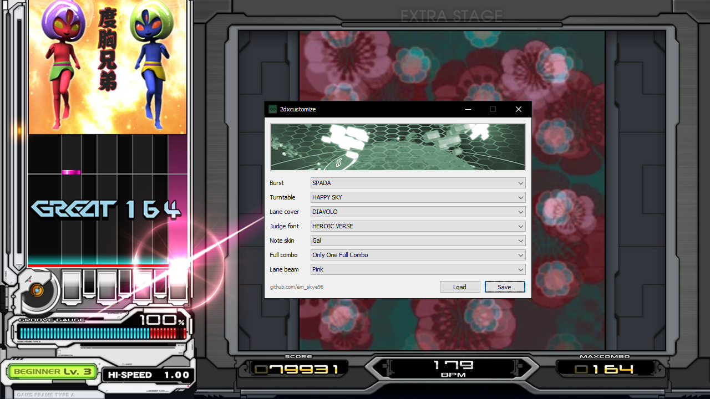

# 2dxcustomize

A simple in-game customization editor for beatmania IIDX INFINITAS.

This tool writes to game memory. **Use at your own risk.**

## Requirements

* [Microsoft Visual C++ Redistributable for Visual Studio 2019 (64-bit)](https://aka.ms/vs/16/release/vc_redist.x64.exe)

## Usage

1. Download, extract, and open the `2dxcustomize.exe` executable.
2. Click the <kbd>Load</kbd> button after reaching the Mode Select screen.
3. Edit options to your liking, then press the <kbd>Save</kbd> button.

Your changes will take effect after selecting the next song.